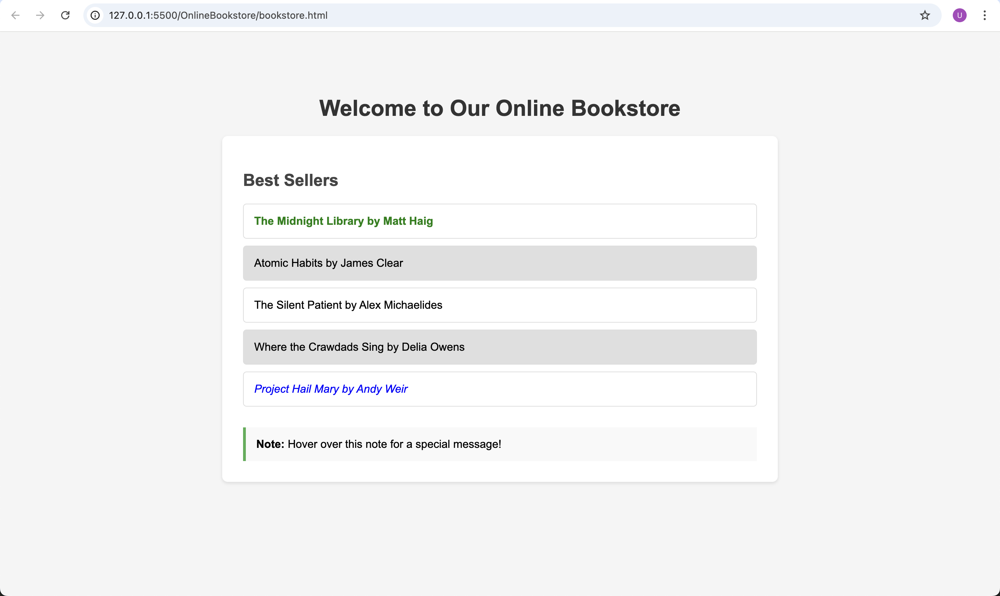

- **Name:** Uddipan Dey
- **Registration No:** 25045008
- **Course:** Full Stack Development (MAI-OL-423-1)
- **Program:** M.Sc AIML Online - Semester I
- **Assignment:** CIA-1 – October 2025

## Assignment Questions

This folder contains solutions for the following questions:

### Question 2: Online Bookstore - Best Sellers Page

File: `bookstore.html`

A webpage with a "Best Sellers" section featuring CSS pseudo-selectors for styling:

- First book highlighted in green bold
- Last book in blue italics
- Even books with grey background
- Hover effects (yellow background, red text)
- Click effects (orange text)
- Visited link styling (purple)
- Hidden message using ::after pseudo-element

### Question 3: News Portal Website

File: `news-portal.html`

A news portal homepage containing:

- Logo and navigation bar
- Highlighted news article with image
- Related articles section
- Footer with copyright and contact info

### Question 4: Student Profile Card

File: `profile-card.html`

A student profile card built with Tailwind CSS featuring:

- White background with rounded corners and shadow
- Centered bold student name
- Blue button with hover effect

## How to Run

Open any HTML file directly in a web browser to view the pages.
